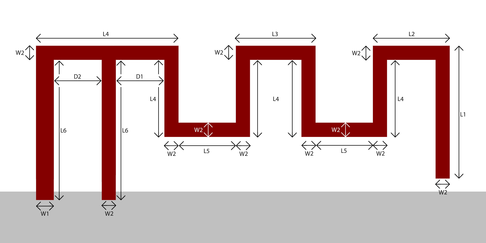

# ESP32 MIFA PCB ANTENNA

Recommended Meandered Inverted-F Antenna (MIFA) footprint library for KiCAD. Measured from the official gerber files provided by Espressif.

### Table 1: Antenna Dimensions

| Reference | mm |
| ------ | ------ |
| L1 | 4.67 mm|
| L2 | 2.7 mm|
| L3 | 2.8 mm|
| L4 | 2.7 mm|
| L5 | 2 mm|
| L6 | 4.91 mm|
| L7 | 5 mm|
| W1 | 0.63 mm|
| W2 | 0.5 mm|
| D1 | 1.7 mm|
| D2 | 1.67 mm|
